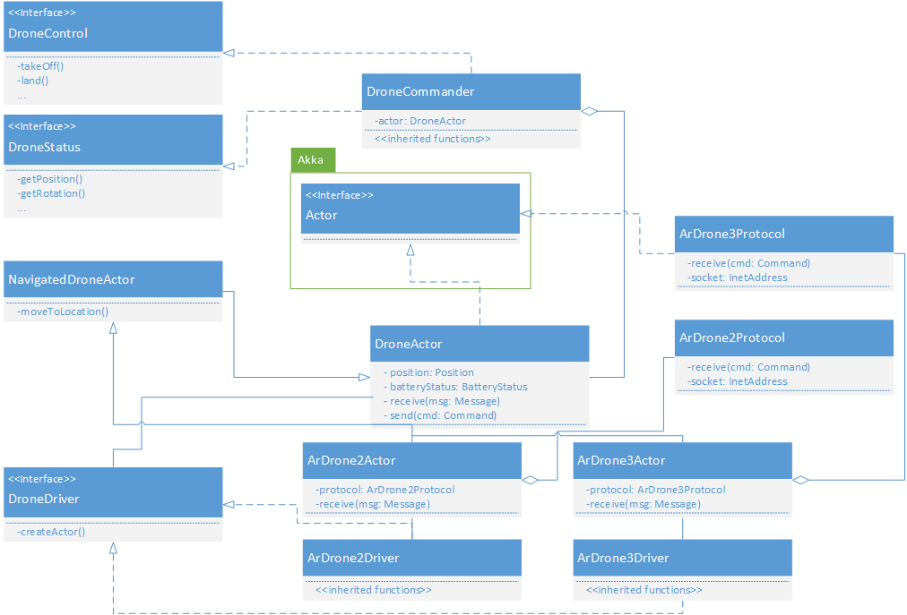

Drone API Architecture
============

This diagram depicts the general simplified drone architecture without any of the CROS components.
Their task is described below.

Many of these classes make use of the Akka Actor pattern. This provides flexible concurrency abstractions and messaging between the classes.
For more information, we refer to [Untyped Actors](http://doc.akka.io/docs/akka/2.3.11/java/untyped-actors.html) and  [Akka](http://doc.akka.io/docs/akka/2.3.11/intro/what-is-akka.html)

DroneControl and DroneStatus
----------------------------

This is a wrapping interface around both the control and status of the drone. The interfaces are split up as a security measure.
It is possible to give a class permissions to reading the drone's status, without giving access to the controlling interfaces. (e.g. for diagnostics or logging)

DroneCommander
--------------

 This class functions as an intermediary between the DroneActors, which can only communicate through messages, and a caller that has no knowledge of the inner Actor implementations.
It wraps the messages into a simplified calling convention with a timeout in case the messages are lost. When controlling a drone, this class should be used.

DroneDriver
------------

This interface provides easy mechanisms to create a DroneActor without any knowledge about the inner workings of both protocols and implementation.
It can be easily registered to a singleton class which can create multiple drones from a single calling interface. It also leaves room for other DroneActor types/implementations.

DroneActor
-----------
This actor is the heart of the whole application. It is a fault-tolerant mediator between the DroneCommander and the underlying protocols.
 It provides a listening and subscription interface for messages from both protocol and external callers. It caches all of the sensor data and forwards this to its subscribers and callers.

The DroneActor expects [X]RequestMessages from external callers and replies these with [X]Messages. When the protocol has to be contacted to e.g. send a new drone command, it sends
these to the DroneProtocol actor using [X]Command messages. These commands can be drone specific and are not part of the general architecture.

NavigatedDroneActor
-------------------

This actor already provides mechanisms to navigate to a given location only based on GPS data.
This can be used when the drone itself does not provide any internal mechanisms to navigate to a given location.

If you want to implement your own Drone navigator, you will also have to update the NavigationState. In NavigatedDroneActor we do it as follows:
* IN_PROGRESS:
  * The drone is doing a assignment (NaviagationReason = REQUESTED)
* UNAVAILABLE:
  * The drone lost its GPS fix (NaviagationReason = CONNECTION_LOST)
* AVAILABLE:
  * The drone obtained a GPS fix (NaviagationReason = ENABLED)
  * The drone finished its assignment (NaviagationReason = FINISHED)
  * The assignment is canceled (NaviagationReason = STOPPED)

ArDroneXActor
--------------

These are drone specific implementations for both ArDrone3 and ArDrone2 models.
When adding a new drone type, this is the place you should start by either extending DroneActor or NavigatedDroneActor.

ArDroneXProtocol
----------------

These are specific implementations that make use of the Akka UDP manager. Some drones would not require an extra protocol actor next to their DroneActor,
but due to the asynchronous nature of network traffic, we opted to use seperate actors for them such that there is no blocking on receive or send.
For more information: [Akka UDP](http://doc.akka.io/docs/akka/2.3.11/java/io-udp.html)
